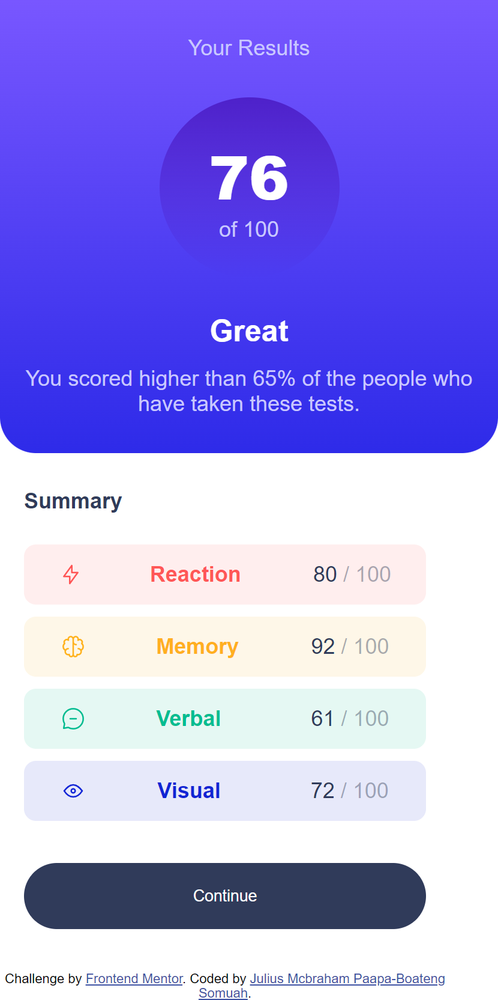
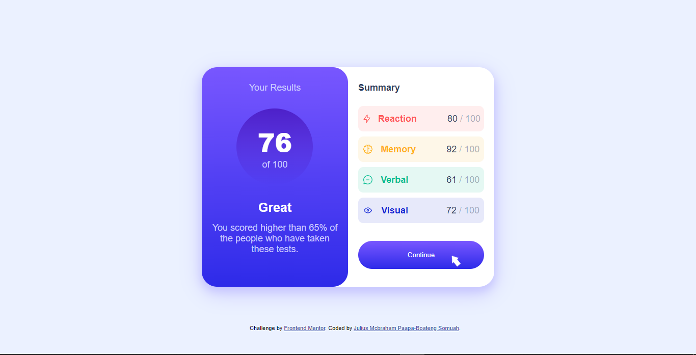

# Frontend Mentor - Results summary component solution

This is a solution to the [Results summary component challenge on Frontend Mentor](https://www.frontendmentor.io/challenges/results-summary-component-CE_K6s0maV). Frontend Mentor challenges help you improve your coding skills by building realistic projects.

## Table of contents

- [Frontend Mentor - Results summary component solution](#frontend-mentor---results-summary-component-solution)
  - [Table of contents](#table-of-contents)
  - [Overview](#overview)
    - [The challenge](#the-challenge)
    - [Screenshot](#screenshot)
    - [Links](#links)
    - [Built with](#built-with)
    - [What I learned](#what-i-learned)
  - [Author](#author)

## Overview

### The challenge

Users should be able to:

- View the optimal layout for the interface depending on their device's screen size
- See hover and focus states for all interactive elements on the page

### Screenshot





### Links

- Solution URL: [Solution](https://your-solution-url.com)
- Live Site URL: [Live Site](https://your-live-site-url.com)

### Built with

- Semantic HTML5 markup
- CSS custom properties
- Flexbox

### What I learned

In this Challenge I learnt how to use flex-direction is css for the responsiveness of this challenge.

```css
@media (max-width: 375px) {
  display: flex;
  flex-direction: column;
  flex: 100%;
}
```

## Author

- Frontend Mentor - [@khophisnow](https://www.frontendmentor.io/profile/khophisnow)
- Twitter - [@khophi_snow](https://www.twitter.com/khophi_snow)
